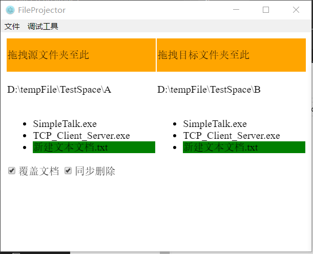
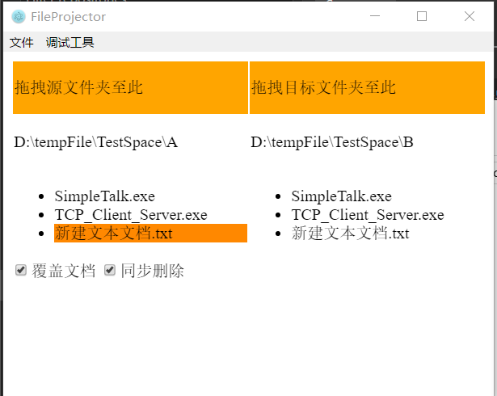
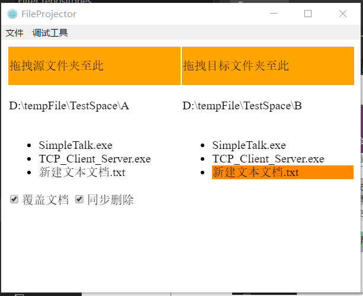
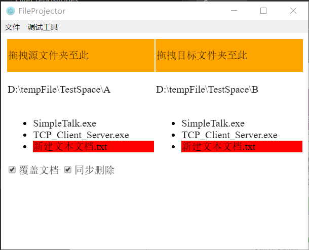
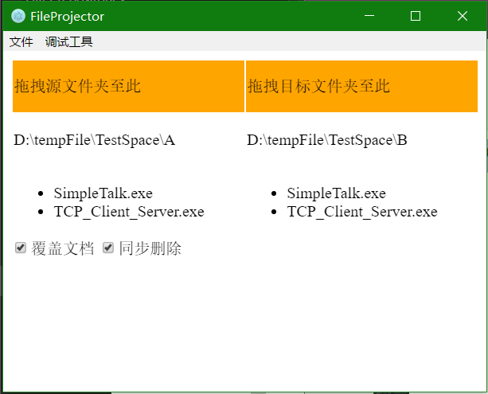

# 文件映射、同步  

主要在两个文件夹中同步更新文件，当源文件夹中的文件发生改变时，自动更新目标文件夹中的文件。

## 使用方法
拖拽指定的文件夹到左（源文件夹）右（目标文件夹）

## 选项

* 覆盖文档
    * 可以选择是否覆盖同名文档，防止覆盖重要数据
* 同步删除
    * 当源文件夹中的文件删除的时候，是否同步删除目标文件夹中的内容

## 截图
当文件发生变换的时候，对应的文件变成橙色，删除文件时会显示红色，新建文件会显示绿色

新建文档

修改文档

删除文档

